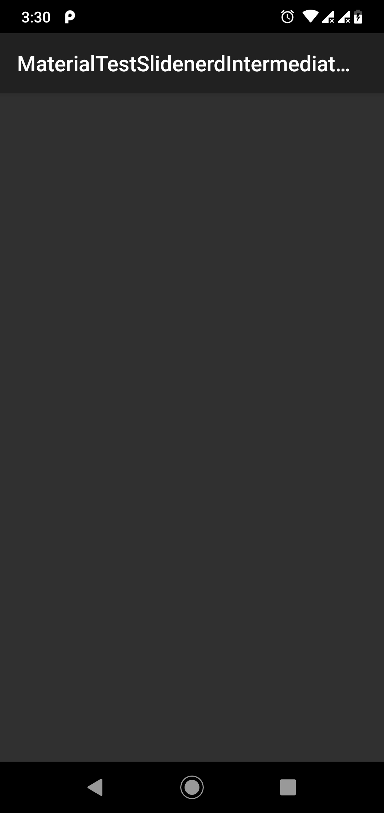
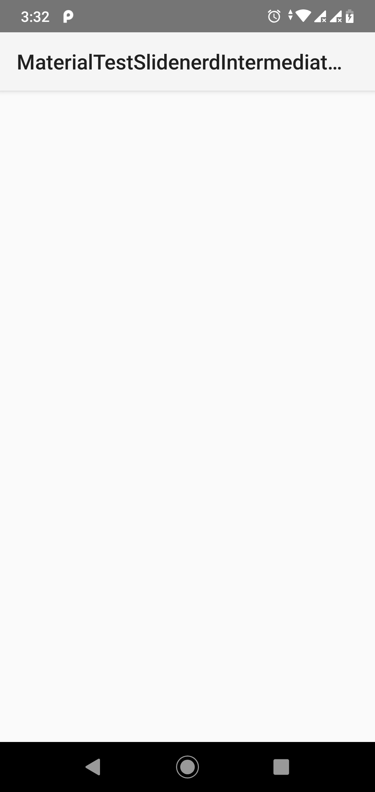
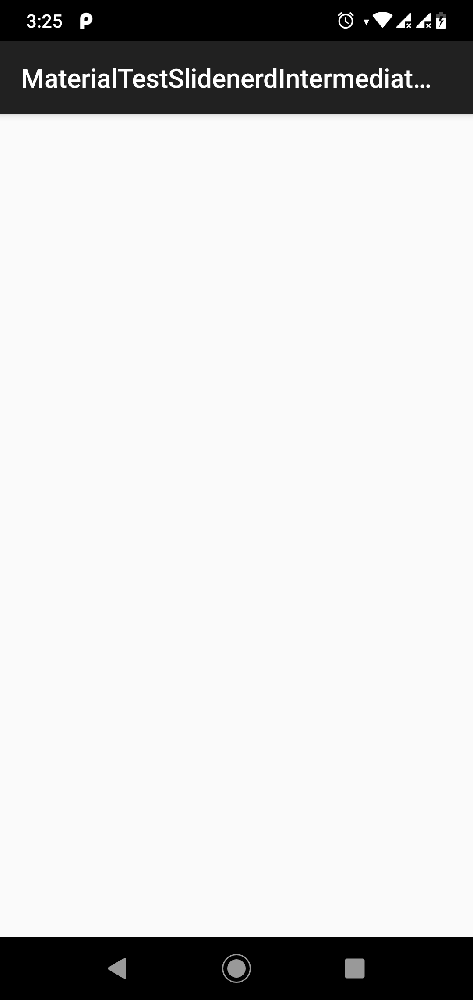

# 4 varieties types of Actionbar 

### "Theme.AppCompat" 
When we will use this theme, it will show Dark background with white text.

### "Theme.AppCompat.Light"
When we will use this theme, it will show actionbar with basic material design, White background with dark text.

### "Theme.AppCompat.Light.DarkActionBar"
When we will use this theme, it will show light background in maximum page but dark background in Action bar.

### "Theme.AppCompat.Light.NoActionBar"
When we will use this theme, it won't show any Actionbar.

